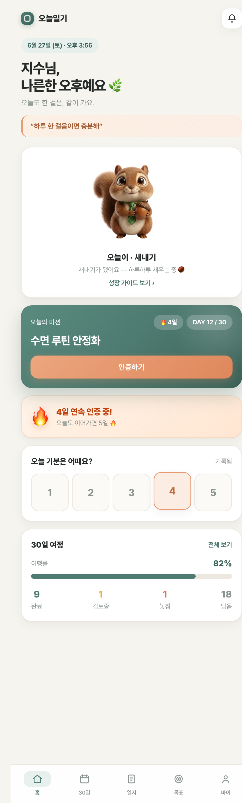
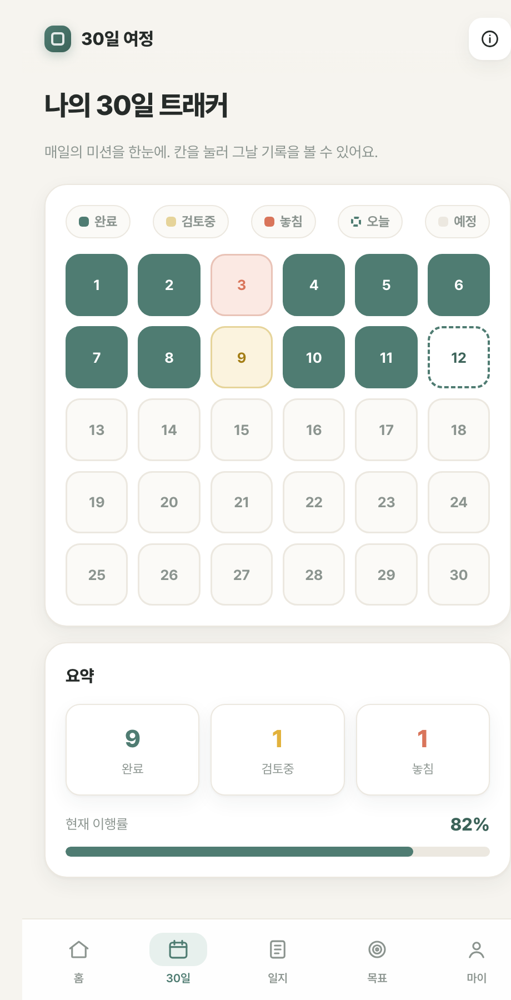
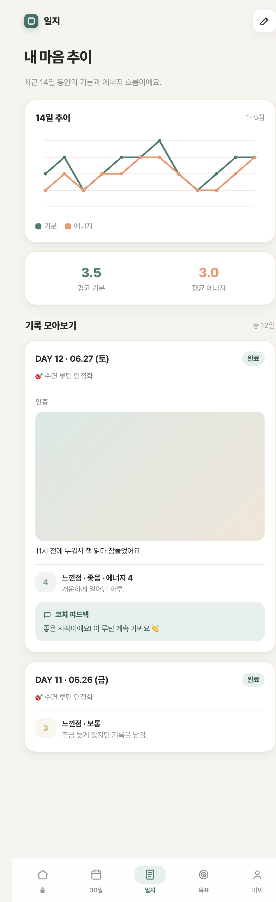
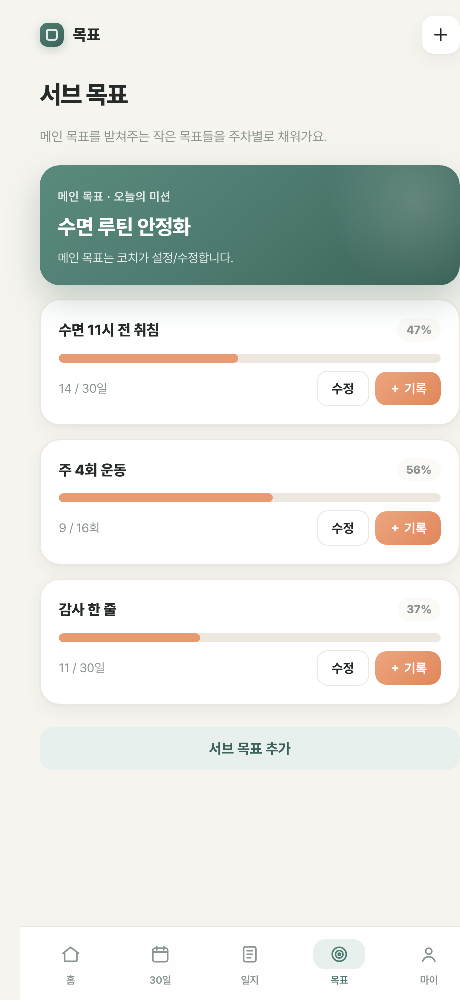
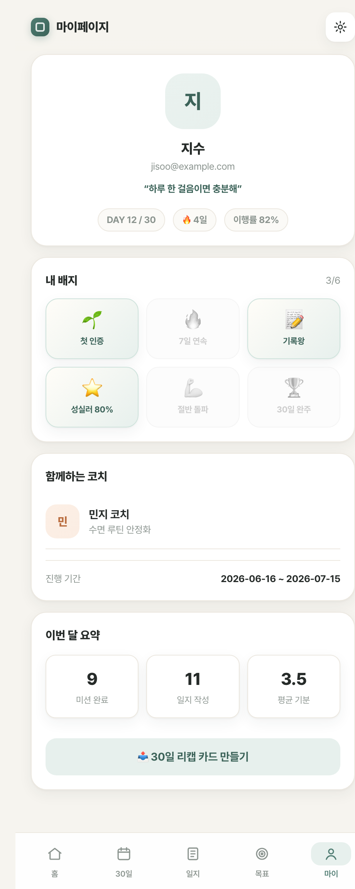
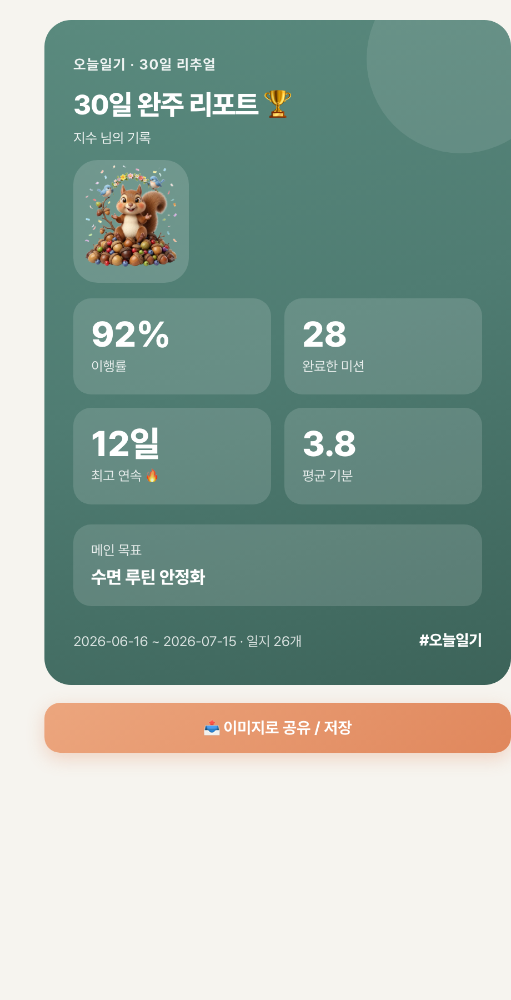
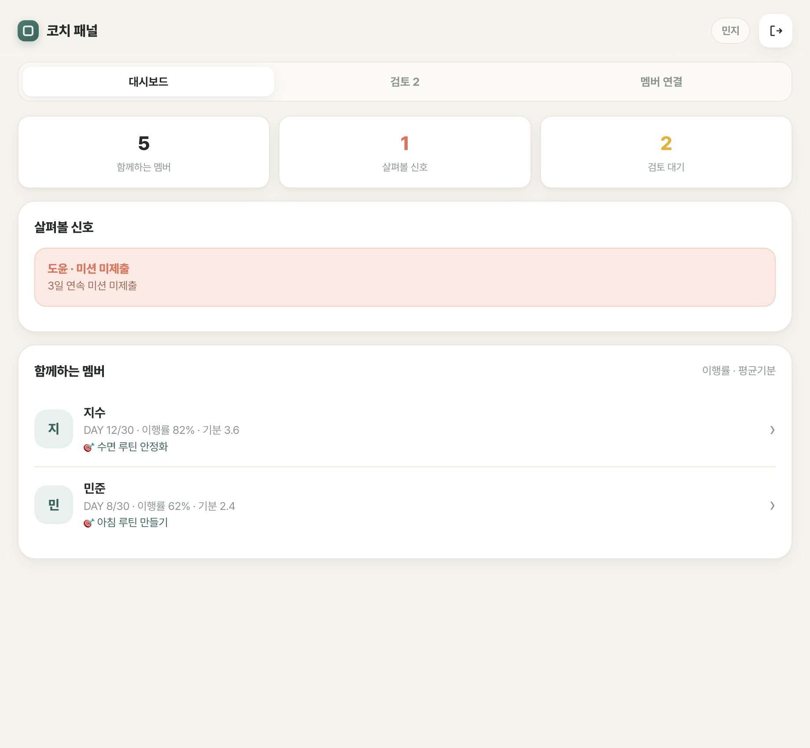
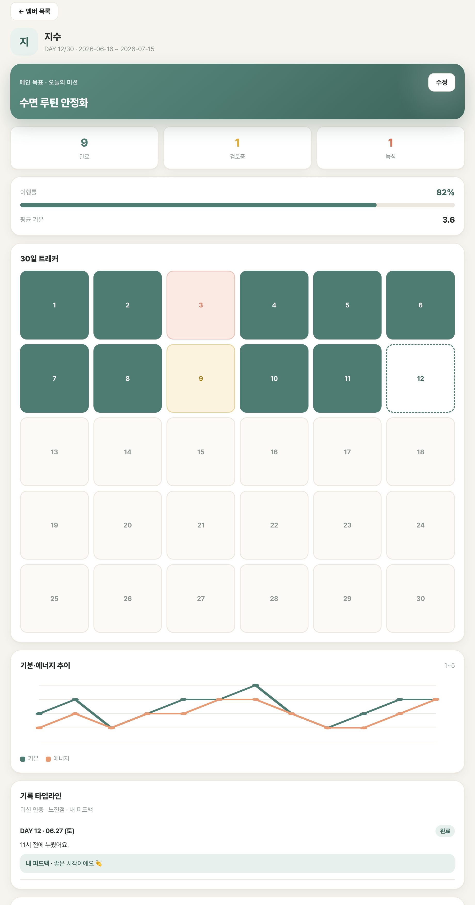
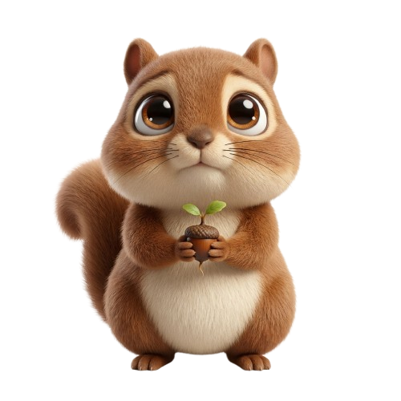

# 오늘일기 가이드북 📔

> 30일 코칭형 습관·일기 앱. **멤버**는 매일 미션을 인증하고 마음을 기록하고, **코치**는 곁에서 살펴보며 피드백합니다.
> 아래는 실제 화면 예시(샘플 데이터)입니다.

---

## 목차
1. [시작하기 — 가입](#1-시작하기--가입)
2. [멤버 가이드](#2-멤버-가이드)
3. [코치 가이드](#3-코치-가이드)
4. [캐릭터 ‘오늘이’ 성장](#4-캐릭터-오늘이-성장)
5. [핵심 개념 & 운영 팁](#5-핵심-개념--운영-팁)

---

## 1. 시작하기 — 가입

가입 화면에서 **멤버 / 코치**를 선택합니다.

- **멤버로 시작** → 이름 + **담당 코치 이름**을 입력 (코치가 가입한 이름과 정확히 일치해야 연결됩니다)
- **코치로 시작** → 이름만 입력하면 코치 패널로 진입

> 멤버는 가입 후 코치가 연결해주기 전까지 "코치 연결 대기" 상태입니다. 코치가 연결하면 30일이 시작돼요.

---

## 2. 멤버 가이드

### 🏠 홈 — 오늘 할 일을 한눈에

- **오늘이 카드**: 내 캐릭터가 미션을 완료할수록 성장 (탭하면 성장 가이드)
- **오늘의 미션**: 코치가 정한 메인 목표. `인증하기`로 사진+메모 제출
- **🔥 스트릭**: 연속 인증 일수
- **기분 기록**: 1~5점 + 한 줄
- **30일 여정**: 이행률 · 완료/검토중/놓침/남음 요약

### 📅 30일 트래커 — 전체 진행도

- 30칸으로 보는 한 달. 완료(초록)·검토중·놓침·오늘·예정 색으로 구분
- 칸을 누르면 그날 미션·인증 사진·코치 코멘트를 봅니다

### 📖 일지 — 기록 모아보기

- 최근 14일 **기분·에너지 추이 그래프** + 평균
- **누적 타임라인**: 하루 카드에 **미션 인증(사진/메모) · 느낀점 · 코치 피드백**이 함께
- 오른쪽 위 ✎ 로 오늘 일지 작성 (기분/에너지/메모)

### 🎯 목표 — 메인 목표 + 서브 목표

- 상단: **메인 목표**(코치가 설정, = 오늘의 미션)
- 아래: 내가 관리하는 **서브 목표** — 추가·수정·삭제 + 주차별 진척 기록

### 🙂 마이페이지 — 배지 · 요약 · 리캡

- 프로필 + 다짐 문구 + DAY/스트릭/이행률
- **배지 컬렉션**: 첫인증·7일연속·기록왕·성실러·절반돌파·완주
- 이번 달 요약 + **30일 리캡 카드 만들기** 버튼, 설정(다크모드/다짐문구)

### 📤 30일 리캡 카드 — 공유용

- 이행률·완료·최고 연속·평균 기분·메인 목표를 한 장으로
- `이미지로 공유/저장` → 인스타 스토리·카톡 등으로 바로 공유

---

## 3. 코치 가이드

### 🧭 대시보드 — 내 멤버 한눈에

- 상단 탭: **대시보드 · 검토 · 멤버 연결**
- KPI: 함께하는 멤버 · 살펴볼 신호 · 검토 대기
- **살펴볼 신호**: 연속 미제출/기분 하락 자동 알림
- **멤버 목록**: 이름·DAY·이행률·평균기분·메인목표. 행을 누르면 상세로

### 👤 멤버 상세 — 깊이 있게 관리

- **메인 목표 수정**(멤버 홈의 미션으로 반영)
- 이행률·평균기분, **30일 트래커**, **기분·에너지 추이**
- 서브 목표 진척
- **기록 타임라인**: 멤버의 인증/느낀점/내 피드백
- **코치 노트**: 날짜 지정해서 상담·관찰 기록 + 다음 포커스

### ✅ 검토 & 연결 (탭)
- **검토**: 멤버가 올린 인증을 사진과 함께 확인 → 승인/반려 + 코멘트(피드백)
- **멤버 연결**: 나를 담당 코치로 지정한 대기 멤버를 연결(메인 목표 입력)하면 30일 시작

---

## 4. 캐릭터 ‘오늘이’ 성장

미션을 완료할수록 다람쥐 **‘오늘이’**가 5단계로 자랍니다 (홈·리캡·성장가이드에 등장).

| | 1. 첫걸음 | 2. 새내기 | 3. 수집가 | 4. 탐험가 | 5. 완주 |
|---|---|---|---|---|---|
| |  |  |  |  |  |
| 메시지 | 도토리 안고 첫걸음 🐿️ | 하루하루 채우는 중 🌰 | 도토리 한가득 🧺 | 성장 모험 중 🧭 | 30일 완주 🎉 |
| 조건 | 0~5개 | 6~11개 | 12~17개 | 18~23개 | 24~30개 |

**⚡ 방전 상태**  — 연속으로 인증을 놓치면 오늘이가 방전돼요(흐리게 표시). 오늘 인증 한 번이면 다시 충전됩니다.

---

## 5. 핵심 개념 & 운영 팁

| 개념 | 뜻 |
|------|-----|
| **메인 목표 = 오늘의 미션** | 코치가 설정/수정, 멤버 홈에 표시 |
| **서브 목표** | 멤버가 관리하는 작은 목표(목표 탭) |
| **인증** | 하루 1건 사진/메모 → 코치 검토(승인/반려) → 피드백 |
| **일기(느낀점)** | 하루 1건 기분·에너지·메모 |

**운영 팁**
- 코치는 가입 시 쓴 **이름**을 멤버에게 정확히 알려주세요 (이름으로 매칭).
- 매일 자정(KST) 자동으로 날짜가 넘어가고, 미제출은 ‘놓침’ 처리됩니다.
- 멤버가 인증하면 코치 **검토** 탭에 쌓입니다 — 가능한 빨리 피드백할수록 동기부여 ↑.

---

*이 가이드북의 화면은 샘플 데이터로 캡처한 예시이며, 실제 데이터에 따라 다르게 보입니다.*
